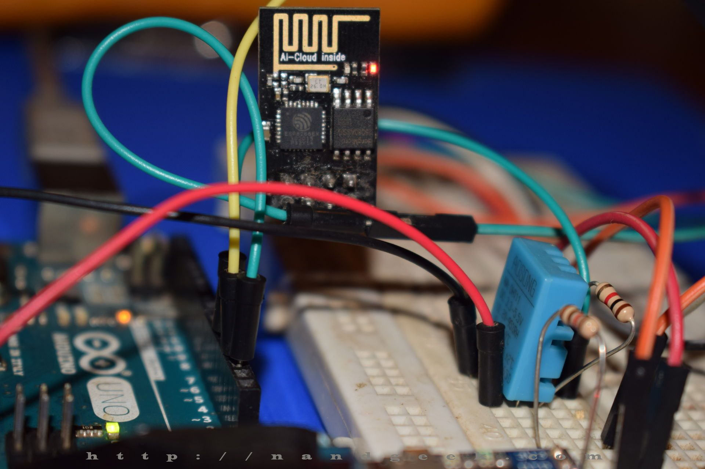
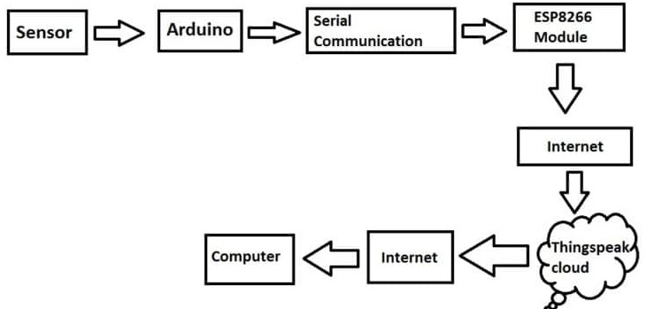

# Arduino-meteo-stanice

Cílem tohoto projektu je seznámení s populární platformou Arduino, která obsahuje 8bitový mikrokontrolér AVR a je vhodná pro celou řadu řídicích aplikací. Bude vytvořen jednoduchý bod v síti IoT (Internet of Things), který bude představovat meteo stanici. Pro bezdrátovou komunikaci je použit WiFi modul ESP8266 ESP-01, dále kombinované teplotní a vlhkostní čidlo DHT12 a pro sběr a vizualizaci dat server [ThingSpeak](https://thingspeak.com/) firmy MathWorks, Inc.



Aplikace je programována ve zjednodušené verzi jazyka C++ v prostředí [Arduino IDE](https://www.arduino.cc/en/software), které je zdarma dostupné pro Windows, Mac OS X i Linuxové distribuce. Data  Pro verifikaci správné funkce aplikací bude použit logický analyzátor firmy [Seleae, Inc.](https://www.saleae.com/)

Blokové zapojení celého zařízení:




## Arduino Uno

Arduino je projekt vyvíjející otevřené platformy založené na 8bitovém mikrokontroléru s architekturou AVR (konkrétně [ATmega328P](https://www.microchip.com/wwwproducts/en/ATmega328P)). Podrobný popis HW modulů, včetně dostupných SW nástrojů, knihoven a manuálů naleznete na [webových stránkách](http://www.arduino.cc). Kromě originálu lze použít i levnější klony, které jsou plně kompatibilní.


Vývojové prostředí Arduino IDE je velmi jednoduché a kromě textového editoru nabízí několik ovládacích prvků. My využijeme pouze: Verify (Compile) pro přeložení zdrojového kódu, Upload pro nahrání binární verze kódu do vývojové desky a Serial Monitor k otevření nového okna s asynchronní komunikaci mezi mikrokontrolérem a počítačem po USB kabelu.


```c
void setup() {
  // put your setup code here, to run once:

}

void loop() {
  // put your main code here, to run repeatedly: 
}
```


## Sériová komunikace se senzorem a UART

### Sběrnice I2C

Kombinované čidlo komunikuje po digitální sériové sběrnici I2C (Inter-integrated Circuit). Ta obsahuje dva vodiče: pro přenos dat s označením SDA a pro přenos hodinových impulzů SCL a umožňuje snadné propojení jednoho nadřízeného obvodu (tzv. master) s více podřízenými obvody (slave). Jako master je použit mikrokontrolér AVR na vývojové desce Arduino Uno a slave obvod je čidlo teploty/vlhkosti DHT12 (lze ale připojit desítky dalších slave obvodů).

Pomocí nepájivého pole připojte na datový (SDA) a hodinový (SCL) signál sběrnice I2C modul pro měření teploty/vlhkosti DHT12. Pro napájení použijte napětí 3.3 V a GND z vývojové desky Arduina.

Při komunikaci na sběrnici I2C se nejprve adresuje podřízený obvod jediněčnou adresou, která je zadaná od výrobce (pro obvod DHT12 je to adresa 184 pro zápis a 185 pro čtení). Následně může proběhnout výměna dat jedním nebo druhým směrem.

Vnitřní uložení dat v senzoru DHT12:

   | **Register address** | **Description** |
   | :-: | :-- |
   | 0x00 | Humidity integer part |
   | 0x01 | Humidity fractional part |
   | 0x02 | Temperature integer part |
   | 0x03 | Temperature fractional part |
   | 0x04 | Checksum |

Hodnota relativní vlhkosti vzduchu i teploty se skládá z celočíselné a desetinné části. Pro zjištění obou veličin je tak potřebné přijmout ze senzoru 4 datové byty uložené od vnitřní adresy 0 až 3.


Pro ovládání komunikace I2C jsou využity funkce z knihovny [`Wire.h`](https://www.arduino.cc/en/reference/wire).

Detailnější informace o sériové komunikaci I2C je možné nalézt v materiálech předmětu [Digitální elektronika 2](https://github.com/tomas-fryza/Digital-electronics-2/tree/master/Labs/08-i2c).


### Asynchronní komunikace UART

Jednotka UART (Universal Asynchronous Receiver Transmiter) umožňuje převádět paralelní data na sériová a opačně. Obsahuje vysílací signál Tx i přijímací Rx a rychlost komunikace se udává v Bd (bódech). Typickou hodnotou je např. 9600 Bd.

Užitečná data jsou zabalena do komunikačního rámce, který začíná start bitem, následuje pět až devět datových bitů seřazených od LSB k~MSB, může být použit paritní bit pro základní ověření korektního příjmu (sudá nebo lichá). Komunikace je zakončena jedním nebo dvěma stop bity. Struktura rámce musí být dopředu domluvena a označuje se symbolicky: 7E2 (sedm datových bitů, sudá parita, dva stop bity), 8N1 (osm dat, bez parity, jeden stop), apod.


Ukázka UART signálu pro přenos hodnoty `0100_0101` (0x45, 69, ASCII kód písmene `E`) v módu 8N1:


Pro ovládání sériové komunikace UART jsou využity interní funkce Arduina [`Serial`](https://www.arduino.cc/reference/en/language/functions/communication/serial/).

Detailnější informace o sériové komunikaci UART je možné nalézt v materiálech předmětu [Digitální elektronika 2](https://github.com/tomas-fryza/Digital-electronics-2/tree/master/Labs/07-uart).


### Zdrojový kód

Kompletní zdrojový kód aplikace pro čtení dat ze senzoru a jejich zobrazení v **Sériovém monitoru** naleznete v adresáři [Arduino > meteo_ver1](https://github.com/tomas-fryza/Arduino-meteo-stanice/blob/main/Arduino/meteo_ver1/meteo_ver1.ino).


## Data na cloudu ThingSpeak


TBD


## WiFi modul ESP8266

Komunikační modul ESP8266 umožňuje využít bezdrátovou síť WiFi, připojit se k ní a odesílát data na server. Ovládání modulu probíhá tzv. AT příkazy.

Pomocí nepájivého pole připojte WiFi modul ESP8266 ESP-01 a Arduino Uno dle obrázku. Výměna dat mezi modulem a řídicím mikrokontrolérem probíhá prostřednictvím asynchronní komunikace. Všimněte si, že vysílací pin modulu je proto spojen s přijímacím pinem Arduino a obráceně.


   | **ESP8266** | **Arduino Uno** |
   | :-: | :-: |
   | U0TXD | Rx (pin 0) |
   | CHIP_EN | 3.3V |
   | EXT_RSTB | Nepřipojeno |
   | 3.3V | 3.3V |
   | GND | GND |
   | GPIO2 | Nepřipojeno |
   | GPIO0 | Nepřipojeno |
   | U0RXD | Tx (pin 1) |

Použijte zdrojový kód z adresáře [Arduino > meteo_ver2](https://github.com/tomas-fryza/Arduino-meteo-stanice/blob/main/Arduino/meteo_ver2/meteo_ver2.ino) a překopírujte jej do prostředí Arduino IDE. Do kódu doplňte informace o vaší WiFi síti a APIWrite kód z předchozího bodu.

```c
// SSID of your WiFi network
String ssid = "xxx";
// Password of your WiFi network
String password = "xxx";
// Write API Key from ThingSpeak cloud
String writeApiKey = "xxx";
```

Kód přeložte a nahrajte do Arduino Uno. Vzhledem k tomu, že programování Arduina probíhá na stejných pinech, kde je připojen i WiFi modul, před samotným uploadem kódu odpojte vodiče z pinů 0 a 1 (Rx a Tx). Po úspěšném naprogramování vodiče opět připojte. Spusťte **Serial Monitor** na kterém pozorujte část komunikace s WiFi modulem (pozor, odpovědi modulu se nezobrazují):

```bash
AT
AT+CWMODE=1
AT+CWJAP="xxx","xxx"
AT+CIPSTART="TCP","api.thingspeak.com",80
AT+CIPSEND=62
GET /update?api_key=xxx&field1=25.0&field2=31.3
AT+CIPSTART="TCP","api.thingspeak.com",80
AT+CIPSEND=62
```

Je-li komunikace prostřednictvím WiFi sítě korektní, na webové stránce `thingspeak.com` se začnou shromažďovat a zobrazovat změřená data. Pokud tomu tak není, zkontrolujte zadané údaje v kódu, případně si zobrazte asynchronní komunikaci na pinech 0 a 1 pomocí logického analyzátoru.


## Modifikace projektu

Rozšířit tuto základí aplikaci lze celou řadou modulů a senzorů, např. tlak vzduchu, míra osvětlení, senzor srážek, síla větru, vlhkost půdy, aj. Velký výběr naleznete např. na serveru [dratek.cz](https://dratek.cz/).

Sběr meteodat, systém pro závlahu rostlin, LoRa síť: [bakalářská práce](https://www.facebook.com/URELBrno/posts/1459331204276701)


## Kontakt

[Tomáš Frýza](https://www.vutbr.cz/lide/tomas-fryza-11389)

[Ústav radioelektroniky](https://www.urel.fekt.vut.cz/)

Studijní program [Elektronika a komunikační technologie](https://www.urel.fekt.vut.cz/bakalarsky-program)

[Facebook](https://www.facebook.com/URELBrno)


