[](https://www.urel.fekt.vut.cz/bakalarsky-program)


# Jednoduchá meteo stanice

Cílem tohoto projektu je seznámení s populární platformou Arduino, která obsahuje 8bitový mikrokontrolér AVR a je vhodná pro celou řadu řídicích aplikací. Bude vytvořen jednoduchý bod v síti Internet of Things, konkrétně meteo stanici se senzorem teploty a relativní vlhkosti vzduchu. Pro odesílání dat na server ThingSpeak je použita WiFi komunikace.


# Obsah
* [Použité komponenty](#Použité-komponenty)
* [Blokový diagram aplikace](#Blokový-diagram-aplikace)
* [Arduino Uno](#Arduino-Uno)
* [Sériová komunikace se senzorem a UART](#Sériová-komunikace-se-senzorem-a-UART)
  * [Sběrnice I2C](#Sběrnice-I2C)
  * [Asynchronní komunikace UART](#Asynchronní-komunikace-UART)
  * [Zobrazení dat ze senzoru v Serial monitoru](#Zobrazení-dat-ze-senzoru-v-Serial-monitoru)
* [WiFi komunikace](#WiFi-komunikace)
  * [Server ThingSpeak](#Server-ThingSpeak)
  * [Odeslání dat na server ThingSpeak](#Odeslání-dat-na-server-ThingSpeak)
* [Verze zdrojových kódů](#Verze-zdrojových-kódů)
* [Modifikace projektu](#Modifikace-projektu)
* [Kontakt](#Kontakt)


## Použité komponenty

* Vývojová deska [Arduino Uno](https://arduino-shop.cz/arduino/1353-klon-arduino-uno-r3-atmega328p-ch340-mini-usb-1466635561.html)
* I2C senzor vlhkosti a teploty DHT12 nebo [DHT11](https://dratek.cz/arduino/1360-dht11-dps-vodice-mereni-teploty-a-relativni-vlhkosti-modul-pro-arduino.html): [data sheet DHT12](Docs/dht12_manual.pdf), [návod DHT11](https://navody.dratek.cz/navody-k-produktum/teplotni-senzor-dht11.html)
* WiFi modul [ESP8266](https://dratek.cz/arduino/911-internet-veci-je-tady-tcp-ip-wifi-esp8266-esp-01.html): [AT příkazy](Docs/esp8266_at_instruction_set.pdf)
* [Nepájivé pole](https://dratek.cz/302-nepajive-pole/), propojující [vodiče](https://dratek.cz/arduino/827-vodice-samec-samec-65-kusu.html)
* Prostředí [Arduino IDE](https://www.arduino.cc/en/software) pro Windows, Linux, Mac OS X
* Server [ThingSpeak](https://thingspeak.com/)

Pro ověření komunikace je vhodnou komponentou také:
* 24MHz 8-kanálový [logický analyzátor](https://www.ebay.com/sch/i.html?LH_CAds=&_ex_kw=&_fpos=&_fspt=1&_mPrRngCbx=1&_nkw=24mhz%20logic%20analyzer&_sacat=&_sadis=&_sop=12&_udhi=&_udlo=)
* [Ovládací software](https://www.saleae.com/downloads/) logického analyzátoru pro Windows, Linux, Mac OS X

Obvodová schémata byla vytvořena v programu Fritzing 0.8.7b:
* Verze pro [Windows](http://fritzing.org/download/0.8.7b/windows/fritzing.0.8.7b.pc.zip)
* Verze pro [Linux](http://fritzing.org/download/0.8.7b/linux-32bit/fritzing-0.8.7b.linux.i386.tar.bz2)
* Verze pro [Mac OS](http://fritzing.org/download/0.8.7b/mac-os-x-105/fritzing.0.8.7b.cocoa.dmg)
* Model senzoru [DHT12](https://github.com/Bobadas/DHT12_library_Arduino/blob/master/DHT12%20Fritzing%20component.fzpz)
* Model WiFi modulu [ESP8266-01](https://github.com/ydonnelly/ESP8266_fritzing)


## Blokový diagram aplikace

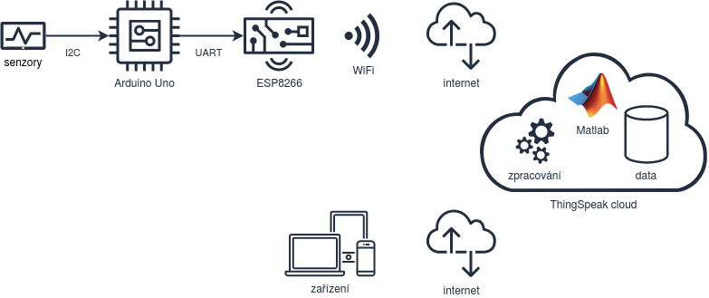


## Arduino Uno

Arduino je projekt vyvíjející otevřené platformy založené na 8bitovém mikrokontroléru s architekturou AVR (konkrétně [ATmega328P](https://www.microchip.com/wwwproducts/en/ATmega328P)). Podrobný popis HW modulů, včetně dostupných SW nástrojů, knihoven a manuálů naleznete na [webových stránkách](http://www.arduino.cc). Kromě originálu lze použít i levnější klony, které jsou plně kompatibilní.

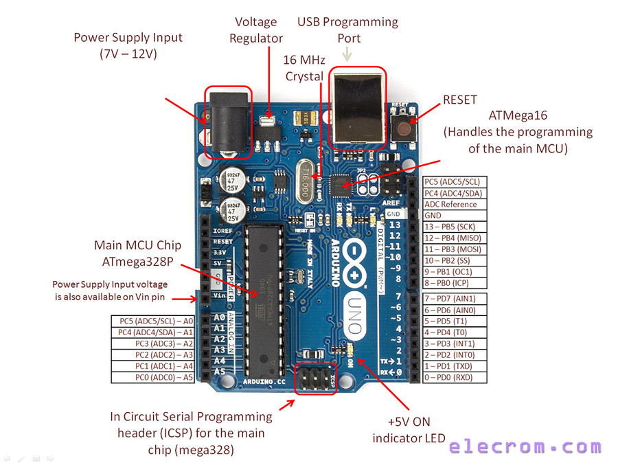

Řídicí program mikrokontroléru (tzv. firmware) je vyvíjen ve zjednodušené verzi jazyka C++ v prostředí [Arduino](https://www.arduino.cc/en/software), které je zdarma dostupné pro Windows, Mac OS X i Linuxové distribuce. Lze použít online verzi Arduino Web Editor (ke kterému je potřeba doinstalovat Arduino Create Agent pro programování hardwaru) nebo si stáhnout a lokálně nainstalovat prostředí Arduino IDE.

Toto prostředí je velmi jednoduché a kromě textového editoru nabízí jen několik ovládacích prvků. My využijeme pouze: **Verify** pro přeložení zdrojového kódu, **Upload** pro nahrání binární verze kódu do vývojové desky a **Serial Monitor** k otevření nového okna s asynchronní komunikaci mezi mikrokontrolérem a počítačem po USB kabelu.

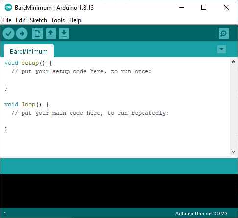


## Sériová komunikace se senzorem a UART

### Sběrnice I2C

Pomocí nepájivého pole a vodičů připojte na datový (SDA) a hodinový (SCL) signál sběrnice I2C modul pro měření teploty/vlhkosti DHT12. Pro napájení použijte napětí 3.3 V a GND z vývojové desky Arduina.

   | **DHT12** | **Arduino Uno** |
   | :-: | :-: |
   | + | 3.3V |
   | SDA | SDA |
   | - | GND |
   | SCL | SCL |

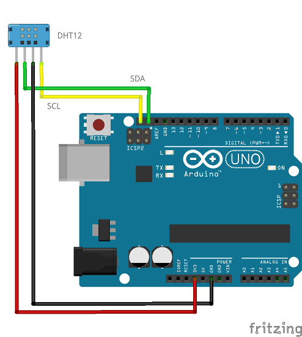

Kombinované čidlo komunikuje po digitální sériové sběrnici I2C (Inter-integrated Circuit). Ta obsahuje dva vodiče: pro přenos dat s označením SDA a pro přenos hodinových impulzů SCL a umožňuje snadné propojení jednoho nadřízeného obvodu (tzv. master) s více podřízenými obvody (slave). Jako master je použit mikrokontrolér AVR na vývojové desce Arduino Uno a slave obvod je čidlo teploty/vlhkosti DHT12 (lze ale připojit desítky dalších slave obvodů).

Při komunikaci na sběrnici I2C se nejprve adresuje podřízený obvod jediněčnou adresou, která je zadaná od výrobce (pro obvod DHT12 je to adresa 184 pro zápis a 185 pro čtení). Následně může proběhnout výměna dat jedním nebo druhým směrem.

Vnitřní uložení dat v senzoru DHT12:

   | **Adresa registru** | **Popis** |
   | :-: | :-- |
   | 0 | Celočíselná část vlhkosti |
   | 1 | Desetinná část vlhkosti |
   | 2 | Celočíselná část teploty |
   | 3 | Desetinná část teploty |
   | 4 | Kontrolní součet |

Hodnota relativní vlhkosti vzduchu i teploty se skládá z celočíselné a desetinné části. Pro zjištění obou veličin je tak potřebné přijmout ze senzoru 4 datové byty uložené na vnitřní adrese 0 až 3. Ukázka sériové komunikace I2C pomocí logického analyzátoru; konkrétně byla přenesena hodnota vlhkosti `24.0`% a teploty `22.4` stupňů Celsia:

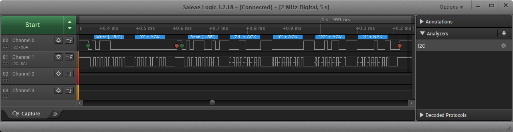

Pro ovládání komunikace I2C jsou využity funkce z knihovny [`Wire.h`](https://www.arduino.cc/en/reference/wire). Detailnější informace o sériové komunikaci I2C je možné nalézt v materiálech předmětu [Digitální elektronika 2](https://github.com/tomas-fryza/Digital-electronics-2/tree/master/Labs/08-i2c).


### Asynchronní komunikace UART

Jednotka UART (Universal Asynchronous Receiver Transmiter) umožňuje převádět paralelní data na sériová a opačně. Obsahuje vysílací signál Tx i přijímací Rx a rychlost komunikace se udává v Bd (bódech). Typickou hodnotou je např. 9600 Bd.

Užitečná data jsou zabalena do komunikačního rámce, který začíná start bitem, následuje pět až devět datových bitů seřazených od LSB k MSB, může být použit paritní bit pro základní ověření korektního příjmu (sudá nebo lichá). Komunikace je zakončena jedním nebo dvěma stop bity. Struktura rámce musí být dopředu domluvena a označuje se symbolicky: 7E2 (sedm datových bitů, sudá parita, dva stop bity), 8N1 (osm dat, bez parity, jeden stop), apod.

Ukázka UART komunikace v módu 8N1 pomocí logického analyzátoru:

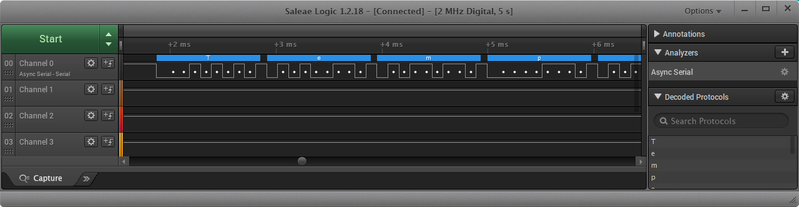

Pro ovládání sériové komunikace UART jsou využity interní funkce Arduina [`Serial`](https://www.arduino.cc/reference/en/language/functions/communication/serial/). Detailnější informace o sériové komunikaci UART je možné nalézt v materiálech předmětu [Digitální elektronika 2](https://github.com/tomas-fryza/Digital-electronics-2/tree/master/Labs/07-uart).


### Zobrazení dat ze senzoru v Serial monitoru

Zdrojový kód aplikace pro čtení dat ze senzoru a jejich zobrazení v **Sériovém monitoru** překopírujte z [meteo_ver1](https://github.com/tomas-fryza/Arduino-meteo-stanice/blob/main/Arduino/meteo_ver1/meteo_ver1.ino) do Arduino IDE, zkompilujte jej a nahrajte do vývojové desky. Otevřete sériový monitor a nastavte v něm stejnou symbolovou rychlost s jakou mikrokontrolér data vysílá, tj. 9600 baud.

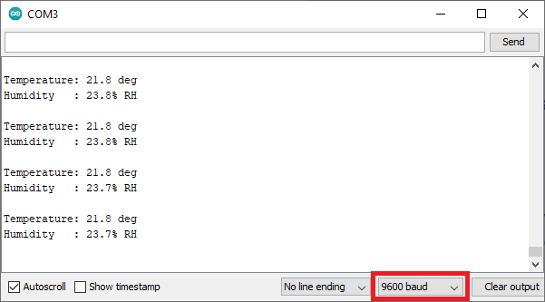


## WiFi komunikace

Komunikační modul ESP8266 umožňuje využít bezdrátovou síť WiFi, připojit se k ní a odesílat data na server. Ovládání modulu probíhá prostřednictvím tzv. [AT příkazu](Docs/esp8266_at_instruction_set.pdf) což jsou textové řetězce začínající znaky `AT` a pokračující příkazem z manuálu.

Pomocí nepájivého a vodičů pole připojte WiFi modul ESP8266 ESP-01 a Arduino Uno dle tabulky. Výměna dat mezi modulem a řídicím mikrokontrolérem probíhá prostřednictvím asynchronní komunikace. Všimněte si, že vysílací pin modulu je proto spojen s přijímacím pinem Arduino a obráceně.

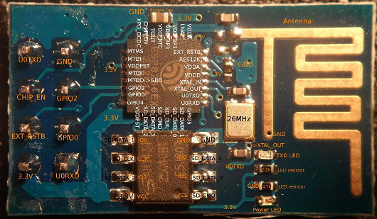

   | **ESP8266** | **Arduino Uno** |
   | :-: | :-: |
   | U0TXD | Rx (pin 0) |
   | CHIP_EN | 3.3V |
   | EXT_RSTB | Nepřipojeno |
   | 3.3V | 3.3V |
   | GND | GND |
   | GPIO2 | Nepřipojeno |
   | GPIO0 | Nepřipojeno |
   | U0RXD | Tx (pin 1) |


### Server ThingSpeak

Pro vytvoření komunikačního kanálu pro sběr dat z vašeho senzoru postupujte podle následujících kroků:

1. V prohlížeči otevřete stránku https://thingspeak.com/ a stiskněte tlačítko **Get Started For Free**.

   

2. Vytvořte si účet--který je zdarma--pomocí vašeho emailu. Žádnou reklamu na email nerozesílají. Po vytvoření se do systému nalogujte.
3. Vytvořte nový komunikační kanál tlačítkem **New Channel**. Seznam kanálů naleznete kdykoliv v menu **Channels > My Channels**.
4. Vyplňte jméno kanálu, jeho případný popis a vyberte kolik hodnot budete v kanálu posílat. V části **Tags** můžete uvést klíčová slova, podle kterých bude váš kanál lépe dosažitelný. Vše uložte tlačítkem **Save Channel**.

   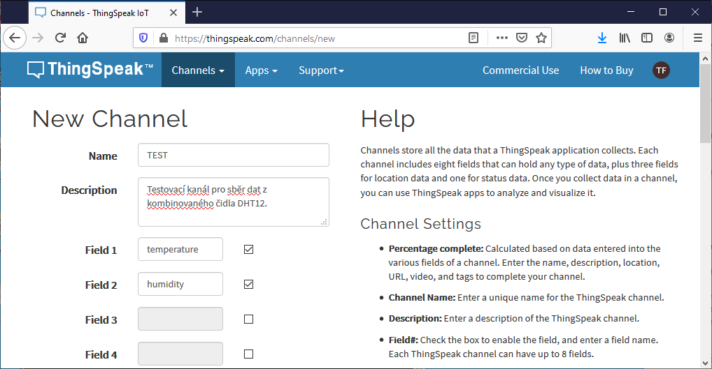

5. Nastavení kanálu můžete kdykoliv změnit a doplnit v záložce **Channel Settings**. Volbou **Sharing** lze nastavit, zda vaše data budou dostupná všem, nebo jen vám po nalogování. V záložce **API Keys** naleznete identifikátory, které byly pro váš kanál vygenerovány a jsou jeho jedinečným označením. V naší aplikaci budeme na server pouze zapisovat a budeme tak potřebovat pouze **Write API Key**, který později vložíme do zdrojového kódu aplikace.

   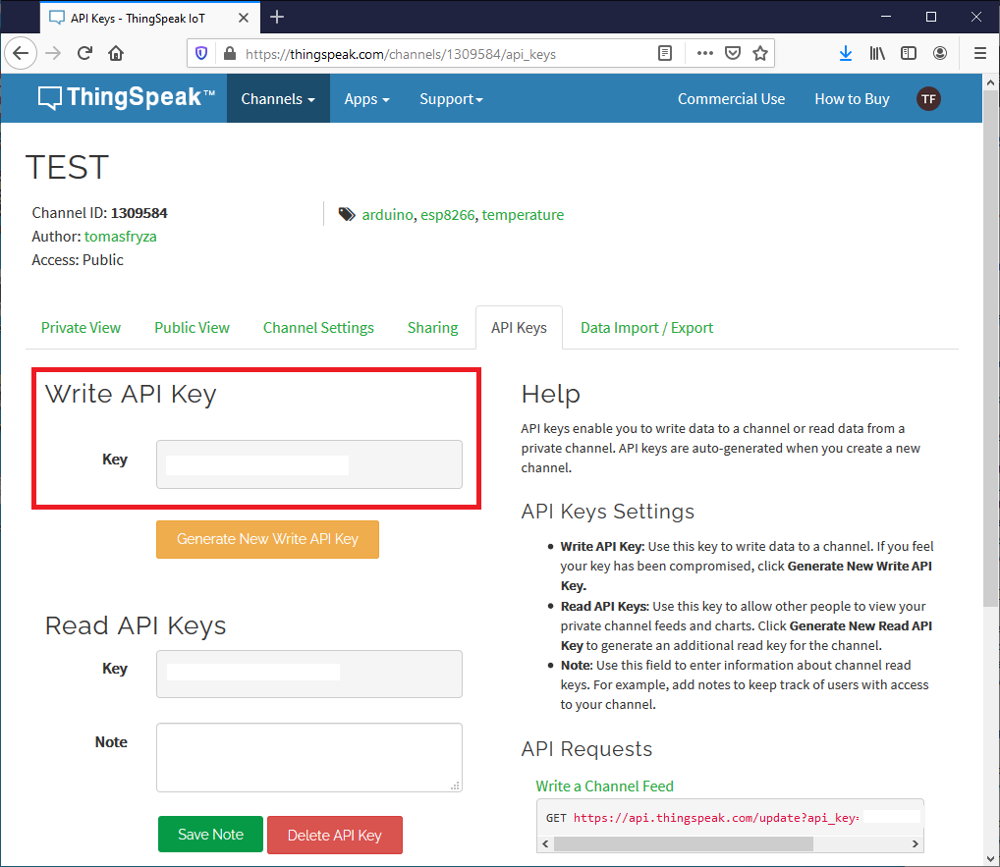

6. Data je možné zobrazit odděleně pro vás (**Private View**) nebo pro všechny ostatní (**Public View**).


### Odeslání dat na server ThingSpeak

Použijte zdrojový kód [meteo_ver2](https://github.com/tomas-fryza/Arduino-meteo-stanice/blob/main/Arduino/meteo_ver2/meteo_ver2.ino) a překopírujte jej do prostředí Arduino IDE. Do kódu doplňte informace o vaší WiFi síti a APIWrite kód z předchozího bodu.

```c
// ENTER YOUR VALUES
String ssid = "xxx";        // SSID of your WiFi network
String password = "xxx";    // Password of your WiFi network
String writeApiKey = "xxx"; // Write API Key from ThingSpeak cloud
```

Kód přeložte a nahrajte do Arduino Uno. Vzhledem k tomu, že programování Arduina probíhá na stejných pinech, kde je připojen i WiFi modul, před samotným uploadem kódu odpojte vodiče z pinů 0 a 1 (Rx a Tx). Po úspěšném naprogramování vodiče opět připojte. Spusťte **Serial Monitor** na kterém pozorujte část komunikace s WiFi modulem (pozor, odpovědi modulu se nezobrazují a je nutné nastavit rychlost komunikace na 115200 baud):

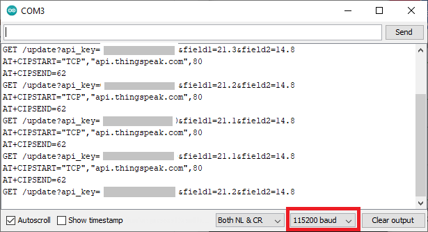

Je-li komunikace prostřednictvím WiFi sítě korektní, na webové stránce `thingspeak.com` se začnou shromažďovat a zobrazovat změřená data (jako např. [zde](https://thingspeak.com/channels/1309584)). Pokud tomu tak není, zkontrolujte zadané údaje v kódu, případně si zobrazte asynchronní komunikaci na pinech 0 a 1 pomocí logického analyzátoru. 

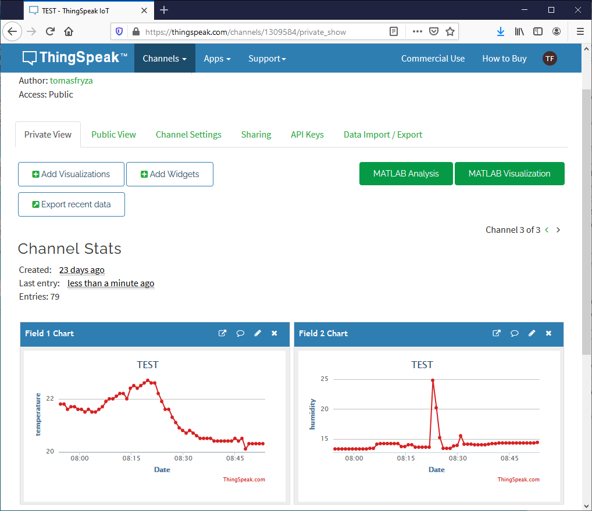


## Verze zdrojových kódů

   | **Číslo verze** | **Popis** |
   | :-: | :-- |
   | [ver1](Arduino/meteo_ver1/meteo_ver1.ino) | Čtení teploty + vlhkosti z DHT12 a zobrazení v Serial monitoru |
   | [ver2](Arduino/meteo_ver2/meteo_ver2.ino) | Čtení hodnot z DHT12 a odeslání pomocí ESP8266 na ThingSpeak |
   | [ver3](Arduino/meteo_ver3/meteo_ver3.ino) | Komunikace s WiFi modulem ESP8266 pomocí softwarového UARTu  |


## Modifikace projektu

Rozšířit tuto základí aplikaci lze celou řadou modulů a senzorů, např. tlak vzduchu, míra osvětlení, senzor srážek, síla větru, vlhkost půdy, aj. Velký výběr naleznete např. na serveru [dratek.cz](https://dratek.cz/).

Sběr meteodat, systém pro závlahu rostlin, LoRa síť: [bakalářská práce](https://www.facebook.com/URELBrno/posts/1459331204276701)


## Kontakt

[Tomáš Frýza](https://www.vutbr.cz/lide/tomas-fryza-11389)

<!-- Please don't remove this: Grab your social icons from https://github.com/carlsednaoui/gitsocial -->
<!-- display the social media buttons in your README -->

[![alt text][2.1]][2]
[![alt text][6.1]][6]


<!-- links to social media icons -->
<!-- no need to change these -->

<!-- icons with padding -->

[1.1]: http://i.imgur.com/tXSoThF.png (twitter icon with padding)
[2.1]: http://i.imgur.com/P3YfQoD.png (facebook icon with padding)
[3.1]: http://i.imgur.com/yCsTjba.png (google plus icon with padding)
[4.1]: http://i.imgur.com/YckIOms.png (tumblr icon with padding)
[5.1]: http://i.imgur.com/1AGmwO3.png (dribbble icon with padding)
[6.1]: http://i.imgur.com/0o48UoR.png (github icon with padding)

<!-- icons without padding -->

[1.2]: http://i.imgur.com/wWzX9uB.png (twitter icon without padding)
[2.2]: http://i.imgur.com/fep1WsG.png (facebook icon without padding)
[3.2]: http://i.imgur.com/VlgBKQ9.png (google plus icon without padding)
[4.2]: http://i.imgur.com/jDRp47c.png (tumblr icon without padding)
[5.2]: http://i.imgur.com/Vvy3Kru.png (dribbble icon without padding)
[6.2]: http://i.imgur.com/9I6NRUm.png (github icon without padding)


<!-- links to your social media accounts -->
<!-- update these accordingly -->

[1]: http://www.twitter.com/carlsednaoui
[2]: https://www.facebook.com/URELBrno
[3]: https://plus.google.com/+CarlSednaoui
[4]: http://carlsed.tumblr.com
[5]: http://dribbble.com/carlsednaoui
[6]: http://www.github.com/tomas-fryza

<!-- Please don't remove this: Grab your social icons from https://github.com/carlsednaoui/gitsocial -->

Bakalářský studijní program [Elektronika a komunikační technologie](https://www.urel.fekt.vut.cz/bakalarsky-program) na Ústavu radioelektroniky, FEKT VUT v Brně.


